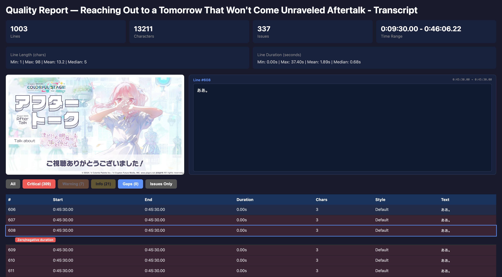

# Subtitling Projects

Japanese-to-English fan subtitle translations for anime, game, and idol content. Subtitles are authored in Aegisub and output as ASS (Advanced SubStation Alpha) files.

## Projects

All projects live under `projects/`, each in a subdirectory named after the content.

### Project Sekai

AfterTalk streams, anniversary videos, and event content from Project Sekai: Colorful Stage! (プロジェクトセカイ カラフルステージ！).

| Project | Status | Notes |
|---------|--------|-------|
| With Our Wounded Hands Aftertalk Part 1 | Complete | |
| With Our Wounded Hands Aftertalk Part 2 | Complete | |
| This story continues with hope Aftertalk | Complete | QC'd |
| 5th Anniversary Video LeoNeed | Complete | |
| Kimi to Tsunagu HeartBeat Aftertalk | Complete | |
| Find the dream view Aftertalk | Complete | |
| Unsteady, still steady step Aftertalk | Complete | |
| Colors of Pure Sense (ena6) | In Progress | Transcript generated via Chirp 3; translation not started |
| Reaching Out to a Tomorrow That Won't Come Unraveled Aftertalk (mizu6) | In Progress | Transcript generated via Chirp 3; translation not started |

### Lieraji (Liella no Radio Japan)

Episodic radio show featuring the Love Live! Superstar!! Liella! cast.

| Project | Status | Notes |
|---------|--------|-------|
| Episode 247 | In Progress | Draft translation in markdown |
| Episode 248 | Not Started | Whisper transcript only |
| Episode 249 | In Progress | ASS file started |

### Liella 6th to 7th

Love Live! Superstar!! Liella! live concert content.

| Project | Status | Notes |
|---------|--------|-------|
| Concert MC 1 | Complete | `1-en.ass` |

## Toolchain

| Tool | Purpose |
|------|---------|
| **yt-dlp** | Download source video from YouTube/Bilibili |
| **ffmpeg** | Convert formats, trim video, extract audio, hardsub |
| **whisper** | Generate Japanese transcript from audio (local, quick) |
| **transcribe.py** | GCP Speech-to-Text (Chirp 3) batch transcription, outputs raw JSON |
| **json_to_ass.py** | Convert Chirp 3 JSON transcripts to ASS with word-level line splitting |
| **quality_report.py** | Quality analysis and reporting — `.log` (untruncated) and interactive `.html` viewer |
| **translate.py** | JP→EN translation via Gemini (Vertex AI). Structured JSON output, cross-line context, fixed phrase glossary. Separate API/content retries with exponential backoff, checkpoint resume |
| **compare_translations.py** | Side-by-side JP/EN comparison HTML report with char ratio warnings and optional video player |
| **post_processing.py** | Post-processing for translated subtitles. Merges absorbed empty lines into neighbors |
| **utils/** | Shared utility modules: `audio.py` (ffmpeg/ffprobe), `gcs.py` (GCS ops), `time.py` (timestamps), `ass_parser.py` (ASS parsing/writing) |
| **tests/** | Unit tests (`unittest`) for utils/ and main scripts. All external deps mocked |
| **Aegisub** | Manual subtitle editing and timing |

## Transcription Pipeline

For longer audio or when higher accuracy is needed, a two-script pipeline handles GCP Chirp 3 transcription:

```
local video/audio (or GCS URI)
  → transcribe.py (extract audio, chunk, upload, transcribe, generate ASS)
  → raw JSON (per-chunk + merged.json) + Transcript.ass + .log + .html
  → Aegisub (manual translation and timing)
```

**Transcribe + generate ASS (single command)**

```bash
export GOOGLE_CLOUD_PROJECT=your-project-id

# From a local video file (auto-extracts audio)
uv run transcribe.py --input "video.mkv"

# Or from a GCS URI
uv run transcribe.py \
  --input "gs://subtitling-projects/audio-files/audio.opus" \
  --transcripts-dir "raw_transcripts/"

# Skip leading silence/intro (timestamps still align with original file)
uv run transcribe.py --input "video.mkv" --trim-start 120

# Override output paths
uv run transcribe.py \
  --input "video.mkv" \
  --transcripts-dir "raw_transcripts/" \
  --ass-output "custom.ass"
```

[Chirp 3 only supports word-level timestamps for audio up to 20 minutes](https://cloud.google.com/speech-to-text/docs/models/chirp-3). Audio longer than this is automatically split into non-overlapping chunks (default 18 min), each chunk is transcribed separately, and the transcripts are stitched back together with adjusted timestamps into a single `merged.json`. Video files are detected and audio is extracted (stream copy, no re-encoding). Non-Opus audio (e.g., AAC from MP4/MKV) is automatically re-encoded to Opus before uploading — Chirp 3 returns empty results for AAC input.

**Tune line splitting** (re-run `json_to_ass.py` without re-transcribing):

```bash
python3 json_to_ass.py raw_transcripts/merged.json output.ass \
  --pause-threshold 0.5 \
  --max-line-chars 100 \
  --comma-split-chars 30 \
  --lead-in 0.125 \
  --lead-out 0.5
```

### How Line Splitting Works

Chirp 3 returns its transcription as a **single giant blob of text per chunk** — one "result" containing thousands of words with individual timestamps, but no sentence boundaries or line breaks. `json_to_ass.py` splits this blob into subtitle-sized lines using the word-level timestamps.

Here's what a raw Chirp 3 result looks like (from the mizu6 AfterTalk transcript, chunk 1 — **3,150 words in a single result**):

```
"プロセカアフタートーク、ほどけぬ明日に手を伸ばして辺、イエ。皆さんこんばんは。
25時ナイトコードで宵山みずき役の佐藤ひなたです。このプロセカアフタートークは
皆さんから頂いたおたよりを紹介しながらイベントを振り返る配信となっております。
え、今回はほどけぬ明日に手を伸ばして辺となっています。皆様ストーリーはお楽しみ
いただけましたでしょうか。ちょうどね、昨日まで..."  ← continues for 5,850 characters
```

Each word has individual start/end timestamps from the API:

```
Word              Start       End
─────────────────────────────────────
こんばんは。       583.80s     584.44s
25               584.44s     584.92s
時                584.92s     585.04s
ナイト             585.04s     585.44s
コード             585.44s     585.76s
で                585.76s     585.92s
宵山              585.92s     586.32s
みずき             586.32s     586.60s
役                586.60s     586.80s
の                586.80s     586.92s
佐藤              586.92s     587.20s
ひなた             587.20s     587.48s
です。             587.68s     588.24s     ← sentence ender 。
───── 0.36s gap ─────────────────────
この              588.60s     588.88s     ← new line starts
プロセカ           588.88s     589.36s
```

The splitter walks through these words and breaks into new lines at three trigger points, checked in this order:

#### 1. Sentence enders (。？！?!)

**Every** sentence-ending punctuation mark triggers a new line — no exceptions. This is an intentional design decision: since the word-level timestamps from Chirp 3 give us precise timing for each break point, we prefer to **over-break** rather than try to guess which punctuation marks should be kept together. It's much easier in Aegisub during manual QC (either as a separate pass or during translation) to join lines than to split them — joining is just a delete key, while splitting requires finding the right timestamp and creating a new event.

This approach will be revisited once language-aware line splitting (see [Major Milestones](#language-aware-line-splitting)) is researched and tested.

```
...佐藤ひなたです。│                          ← 。 triggers split
                  │25時ナイトコードで宵山みずき役の佐藤ひなたです。
                  │このプロセカアフタートークは...
```

**Result:**
```
Line 4  [584.44s → 588.24s]  "25時ナイトコードで宵山みずき役の佐藤ひなたです。"
Line 5  [588.60s → 595.32s]  "このプロセカアフタートークは皆さんから頂いたおたよりを紹介しながら..."
```

#### 2. Pauses ≥ 1.0s

When the gap between two consecutive words exceeds `--pause-threshold` (default 1.0s), the line breaks even without punctuation. This catches breath pauses and topic changes.

```
Word timestamps around a 1.36s pause:

  ...したらね、       621.68s → 621.92s
  あの              622.08s → 622.68s
  ═══ 1.36s gap ═══════════════════════  ← pause triggers split
  進学              624.04s → 624.48s
  とか              624.48s → 624.68s
  進路...           625.32s → ...
```

**Result:**
```
Line 13  [622.08s → 622.68s]  "あの"
Line 14  [624.04s → 632.80s]  "進学とか進路とか決めなきゃいけない時期のこと..."
```

#### 3. Max character limit (50 chars)

When accumulated text reaches `--max-line-chars` (default 50), a break is forced regardless of punctuation or pauses. This is a safety net for cases where Chirp 3 omits all punctuation.

#### 4. Smart comma splitting (recursive)

After the initial split, any line exceeding `--comma-split-chars` (default 40) is further split at the **comma with the longest pause after it** — the most natural breath point. This applies recursively, so both halves can be split again if still long.

If no comma is found and the line still exceeds `--max-line-chars`, it falls back to splitting at the **word boundary with the longest pause** — the most natural breath point regardless of punctuation. This handles cases where Chirp 3 omits all punctuation from a long stretch of speech.

```
Before comma splitting (69 chars):
  "また、私も恵那と同じように自分と向き合うことが怖くて逃げていましたが、
   恵那の前向きな姿に背中を押された気がして自分も頑張ろうと思いました。"

Commas and their pauses:
  "また、"     → 0.16s pause after     (position 3 — too early, below min_first_part)
  "が、"       → 0.32s pause after     (position 35 — longest pause ✓)

After comma splitting:
  Line 18  "また、私も恵那と同じように自分と向き合うことが怖くて逃げていましたが、"  (35 chars)
  Line 19  "恵那の前向きな姿に背中を押された気がして自分も頑張ろうと思いました。"    (34 chars)
```

The minimum first-part length is half the threshold (20 chars by default) to avoid tiny fragments like splitting "皆さん、" from a long sentence.

#### Post-processing

After splitting, three post-processing passes clean up timing:

**Lead-in/lead-out** (`--lead-in` 0.125s, `--lead-out` 0.5s): Per fansubbing best practices ([Doki Timing Guide](https://yukisubs.wordpress.com/wp-content/uploads/2016/10/doki_timing_guide.pdf)), subtitles should appear slightly before the speaker starts talking and linger slightly after they finish. This gives the viewer time to register the subtitle.

Lead-in always applies the full amount (the subtitle must appear exactly 125ms before speech), even if it pushes into the previous line's time. Lead-out then yields — the previous line's end is capped or shrunk to match the next line's shifted start. This means the connection point between adjacent lines shifts earlier by the lead-in amount:

```
Word timestamps:     Line 5 [...→ 42.52s]  ─ 0.04s gap ─  Line 6 [42.56s →...]
After lead-in/out:   Line 5 [...→ 42.43s]  Line 6 [42.43s →...]
                                    ↑ line 6 start shifted back full 125ms
                                      line 5 end yields to match
```

**Gap snapping** (`--snap-gap`, default 0.25s): When two consecutive same-style lines have a tiny gap between them (e.g., 0.16s), the gap causes a visible "flash" in the subtitle display. The earlier line's end time is extended to meet the next line's start:

```
Before:  Line 5 [...→ 595.32s]    Line 6 [595.48s →...]     0.16s gap → flash!
After:   Line 5 [...→ 595.48s]    Line 6 [595.48s →...]     seamless
```

**Minimum duration** (`--min-duration`, default 0.5s): Lines shorter than 0.5s are extended via lead-out (end time) or lead-in (start time) so they remain readable on screen, without overlapping neighbors.

### Line Splitting Parameters

| Parameter | Default | Description |
|-----------|---------|-------------|
| `--pause-threshold` | 1.0s | Silence duration that always forces a line break |
| `--max-line-chars` | 50 | Hard character limit per line |
| `--comma-split-chars` | 40 | Lines over this length get split at the comma with the longest pause. Set to 0 to disable |
| `--lead-in` | 0.125 | Lead-in padding in seconds (subtitle appears before speech). Set to 0 to disable |
| `--lead-out` | 0.5 | Lead-out padding in seconds (subtitle lingers after speech). Set to 0 to disable |
| `--snap-gap` | 0.25 | Snap gaps smaller than this (seconds) between same-style lines to prevent flashing. Set to 0 to disable |
| `--min-duration` | 0.5 | Minimum line duration in seconds. Short lines get lead-out/lead-in padding. Set to 0 to disable |
| `--video` | None | Path to source video file. Embeds a player in the HTML report for click-to-seek |

### Setup

Requires [uv](https://docs.astral.sh/uv/getting-started/installation/), ffmpeg, and a GCP project with Speech-to-Text API enabled.

```bash
# Install uv (if not already installed)
curl -LsSf https://astral.sh/uv/install.sh | sh

# Install Python dependencies
uv sync

# Install ffmpeg (macOS)
brew install ffmpeg

# Authenticate with GCP
gcloud auth application-default login
export GOOGLE_CLOUD_PROJECT=your-project-id
```

Run scripts with `uv run` to use the managed environment. `--input` accepts video or audio files (video containers are auto-detected and audio is extracted):

```bash
uv run python3 transcribe.py --input video.mkv   # video: auto-extracts audio
uv run python3 transcribe.py --input audio.opus   # audio: used directly
uv run python3 json_to_ass.py raw_transcripts/merged.json output.ass  # tune splitting only
```

`json_to_ass.py` has no external dependencies and can also be run directly with any Python 3.11+.

## Translation Pipeline

After transcription generates a timed Japanese ASS file, `translate.py` translates it to English using Gemini via Vertex AI:

```
source_jp.ass (timed Japanese subtitles)
  → translate.py (batch translation with project context)
  → source_jp_en.ass (English subtitles, same timing)
  → source_jp_en_comparison.html (side-by-side JP/EN report)
  → Aegisub (manual QC and refinement)
```

**Translate a subtitle file:**

```bash
# Basic translation
uv run translate.py --input "transcript.ass"

# With project-specific context (fixed phrases, character info, terminology)
uv run translate.py \
  --input "transcript.ass" \
  --project "projects/Project Sekai/translation_reference.md"

# With video for comparison report
uv run translate.py \
  --input "transcript.ass" \
  --project "projects/Project Sekai/translation_reference.md" \
  --video "source.mkv"
```

**Re-generate comparison report** (without re-translating):

```bash
uv run compare_translations.py \
  --source "transcript.ass" \
  --translated "transcript_en.ass" \
  --video "source.mkv"
```

### How Translation Works

Translation is sent to Gemini in batches (default 25 lines) with a structured JSON schema for reliable output. Each batch includes the full translation context as a system prompt:

1. **System preamble** — explains the translator role and expected JSON I/O format
2. **Translation instructions** (`translation_instructions.md`) — cross-line context rules, line-ending flow, filler word handling, glossary enforcement
3. **Style guide** (`style_guide.md`) — subtitle formatting, punctuation, pause conventions
4. **Project reference** (`translation_reference.md`) — character context, fixed translations for recurring scripted lines, franchise terminology

The model receives each batch as a JSON array of `{id, style, text}` objects and returns `{id, original, translated}` objects via Gemini's `response_schema` (Pydantic `TranslatedSubtitle` model). This structured output eliminates the need for fragile text parsing.

#### Retry and resilience

**Separate retry counters** prevent connection errors from consuming content-retry budget:

- **API retries** (`MAX_API_RETRIES=5`) — for connection errors (`RemoteProtocolError`, timeouts, 5xx) with exponential backoff (2s, 4s, 8s, 16s, 32s)
- **Content retries** (`MAX_CONTENT_RETRIES=3`) — for missing lines (IDs absent from response). Only missing IDs trigger retries — intentionally empty translations (absorbed filler lines) do not

**Inter-batch delay** — 1s pause between batches to reduce rate limit pressure.

**Checkpoint resume** — a `.partial.json` checkpoint file is written after each batch. If translation is interrupted (crash, timeout, Ctrl-C), restarting the same command resumes from the last completed batch. The checkpoint is deleted on successful completion.

#### Post-processing

After translation, `merge_absorbed_lines()` cleans up lines where the translator absorbed one line's content into a neighbor (common for filler-only or sentence-continuation lines). Empty dialogue lines are removed and their timing is merged into the previous non-empty line (or the next, if at the start).

### Translation Context Files

Each project can have a `translation_reference.md` that provides:

- **Fixed translations** — recurring scripted lines (intros, greetings, segment names, sign-offs) with established English translations. The model uses these verbatim when it recognizes the Japanese text, even with minor transcription variations
- **Character/speaker context** — who the speakers are, their speaking styles, voice actors, and relationships
- **Franchise terminology** — project-specific terms with exact capitalization and spelling (e.g., "AfterTalk", "ProSeka", "Wonderhoi!")

Translation references exist for:
- `projects/Lieraji/translation_reference.md` — Lieraji radio show hosts, greetings, segment names
- `projects/Project Sekai/translation_reference.md` — all 20 ProSeka characters with VAs and personalities (sourced from [Sekaipedia](http://sekaipedia.org/wiki/)), AfterTalk fixed phrases, unit terminology

### Translation Parameters

| Parameter | Default | Description |
|-----------|---------|-------------|
| `--input` | required | Source ASS file (Japanese) |
| `--output` | `{input_stem}_en.ass` | Output ASS file (English) |
| `--project` | None | Path to project `translation_reference.md` |
| `--instructions` | `translation_instructions.md` | Path to top-level translation instructions |
| `--model` | `gemini-2.5-flash` | Gemini model to use |
| `--batch-size` | 25 | Lines per API request |
| `--video` | None | Video path for comparison report |

### Comparison Report

`compare_translations.py` generates an interactive HTML report (same dark theme as the quality report) showing source Japanese and translated English side-by-side:

- **Stats cards** — line count, JP/EN character counts, EN/JP ratio
- **Color-coded rows** — orange for suspiciously short translations, yellow for very long ones
- **Filter buttons** — show all, short translations only, long translations only
- **Optional video player** — click any row to seek and play, with JP and EN text displayed in a "Now Playing" panel

## Quality Reports

Both `transcribe.py` and `json_to_ass.py` automatically generate quality reports alongside the ASS output. Every run produces three files:

| Output | Description |
|--------|-------------|
| `output.ass` | The subtitle file |
| `output.log` | Plain text quality log with **every** flagged line listed (the console truncates to 3–5 per category) |
| `output.html` | Interactive HTML report for examining problematic lines |

### HTML Report

The HTML report provides a visual overview of all dialogue lines, color-coded by issue severity:



- **Red** — critical issues: zero/negative duration, inverted timestamps (start > end)
- **Orange** — warnings: lines spanning >60 seconds, overlapping lines
- **Yellow** — info: lines over 200 characters, lines under 3 characters (likely noise)
- **Blue** — gaps: silence >30 seconds between lines (missed speech or music sections)

**Features:**
- **Filter buttons** at the top to show/hide lines by issue type, or show only flagged lines
- **Click any row** to expand and see which specific issues affect it
- **Sticky header** keeps the filters and column headers visible while scrolling

> Yes I'm aware that this is basically just recreating Aegisub but worse; this was another intentional design decision as a better option to highlight issues. The original option I could think of was to print a comment line above every single flagged line in the ASS file, but that's even more cluttered and harder to read; especially since as of now there's a lot of false positives (e.g., weird lines created from BGM) that are not actually problematic.

> I think this is a good start for the report idea and deserves some iteration. There should be more interactivity or visualization not provided by Aegisub. One idea is a timeline of lines across a video duration with hoverability to see issues with overlap. Another is a word cloud of the most common words in the transcript that can be fed to GCP Chirp model adaptations.

### Video Player

When a source video is available, the HTML report embeds an interactive video player for reviewing flagged lines in context:

```bash
# Embed video player in the HTML report
uv run json_to_ass.py raw_transcripts/merged.json output.ass --video source.mkv
```

`transcribe.py` automatically embeds the video when the input is a local file.

- **Click any line** in the table to seek the video to that timestamp and play
- The **selected line text** is displayed in a styled text box next to the video
- The video pane is **resizable** — drag to adjust the width
- The video and text box **stick to the top** of the page while you scroll through lines

### Log File

The `.log` file contains the same stats as the console output, but lists **all** flagged lines untruncated. This is useful for scripting or when the console output is too long to scroll through. Lines are grouped by issue category with line numbers, timestamps, and text.

## Subtitle Conventions

See `style_guide.md` for full rules. Key points:

- ASS format, 1920x1080 play resolution
- Per-speaker color-coded styles
- Western name order ("Given Family")
- Natural contractions ("I'm", "won't")
- Ellipsis `...` for long pauses, em dash for interruptions
- Japanese terms in italics via `{\i1}text{\i0}`
- Song/event titles quoted, not italicized

Many of the timing practices implemented by the ASS generation script (gap snapping, minimum duration, over-breaking) and the conventions in `style_guide.md` are informed by established fansubbing guides:

- [How to Sub (blubsubs)](https://blubsubs.home.blog/2019/01/15/how-to-sub/) — comprehensive guide covering subtitle styling, translation conventions, and timing best practices
- [Doki Timing Guide (PDF)](https://yukisubs.wordpress.com/wp-content/uploads/2016/10/doki_timing_guide.pdf) — detailed timing reference for lead-in/lead-out, gap handling, and minimum duration

## Testing

```bash
uv run python -m unittest discover -s tests -v
```

170 tests covering timestamp parsing, bogus value clamping, line splitting, lead-in/lead-out padding, gap snapping, min duration, ASS output, transcript loading, `transcript_to_json`, quality analysis, ASS parsing/writing roundtrip, translation prompt assembly, structured response parsing, API/content retry logic, checkpoint save/load/resume, absorbed line merging, comparison report generation, and end-to-end integration. All external dependencies (ffmpeg, GCS, Gemini) are mocked — no network access or credentials needed.

## Major Milestones

### Multi-speaker subtitle generation

Multi-speaker audio content (radio shows, talk streams) is common in the content we subtitle. The industry-standard format for two-speaker radio subtitles positions each speaker's dialogue on their side of the screen with character portraits and name labels — see the [Project Sekai Radio show playlist](https://www.youtube.com/watch?v=8ybnIY9JeyY&list=PL8WITjk7vmaRmv5gyjtTo3sPOV-8bMYf9) for reference.


Currently, Chirp 3 merges all speakers into a single interleaved stream with no speaker attribution, making it impossible to assign lines to speakers automatically.

**Goal:** Generate speaker-attributed ASS subtitles with per-speaker styles (left/right positioning, character names) from multi-speaker audio input.

**Approach (to investigate):**
- Determine if Chirp 3's raw output can distinguish speakers (e.g., via speaker diarization or multiple alternatives)
- If not, evaluate alternative STT APIs or post-processing with speaker diarization models
- Generate ASS with per-speaker styles: left-aligned and right-aligned dialogue, speaker name labels, and optional character portraits

### Language-aware line splitting

Line splitting currently relies on punctuation and pause duration, which is deterministic but naive. When Chirp 3 omits punctuation (common in casual speech), lines can run on too long or break at unnatural points.

**Goal:** Split lines at linguistically natural boundaries, not just punctuation and silence.

**Approach:**
- Use pause duration as a fallback when punctuation is absent
- Use semantic/linguistic analysis to find natural break points in Japanese text (e.g., particle boundaries, clause endings)
- Potentially integrate a lightweight Japanese tokenizer (e.g., MeCab, fugashi) to identify grammatical break points

## TODO

### Bugs

- ~~**Chirp 3 fails on large leading silence**~~: Resolved — use `--trim-start <seconds>` to skip leading silence before transcription. Timestamps are automatically offset to align with the original file

### Enhancements

- **Intelligent audio chunking based on silence**: Currently audio is split into fixed ~18-minute chunks, which risks cutting mid-sentence. Instead, detect long silent portions in the audio and split at those boundaries.
- **Customizable ASS styles**: The ASS header is currently a hardcoded template with fixed styles (Default, JP). Instead, support configurable styles — e.g., per-speaker colors, font choices, positioning — via a style config file or CLI flags. This is a prerequisite for multi-speaker subtitle generation.
- ~~**Template-based translation for episodic programs**~~: Resolved — `translate.py` uses per-project `translation_reference.md` files with fixed translations for recurring scripted lines (intros, greetings, segment names), character context, and franchise terminology. References exist for Lieraji and Project Sekai AfterTalks
- ~~**Fix subtitle flashing**~~: Resolved — `json_to_ass.py` now snaps near-adjacent same-style lines together via `--snap-gap` (default 0.1s). Gaps smaller than the threshold are closed by extending the earlier line's end time.
- ~~**End-to-end pipeline orchestration**~~: Resolved — `transcribe.py` now generates ASS subtitles automatically after transcription. Re-run `json_to_ass.py` separately to tune splitting parameters.
- **Better GCS storage management**: Organize uploaded audio into per-project directories instead of a flat `tmp/` prefix. Add cleanup logic so temporary GCS files are removed when transcription is interrupted or fails (e.g., via signal handler or atexit).
- **Vector embeddings for translation context**: Explore embedding finished JP→EN transcription pairs to build a retrieval-augmented translation agent. Could improve consistency across projects by surfacing similar previously-translated lines as few-shot examples for Gemini.
- **Structured translation references with per-speaker profiles**: Currently `translation_reference.md` is a single flat markdown file. Move to a more structured format (e.g., YAML/JSON) with individual speaker profile files, so each speaker's voice, personality, speech patterns, and fixed phrases are self-contained and composable across projects.

## References

- `workflow.md` — end-to-end subtitle creation process
- `snippets.md` — common CLI commands
- `style_guide.md` — subtitle formatting and style rules
- `translation_instructions.md` — AI translation prompt (cross-line context, filler handling, glossary rules)
- `projects/Lieraji/translation_reference.md` — Lieraji fixed translations and character context
- `projects/Project Sekai/translation_reference.md` — ProSeka AfterTalk fixed translations, all 20 characters
